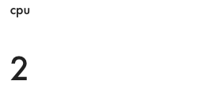
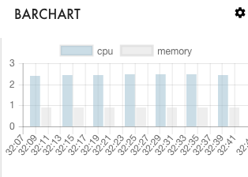
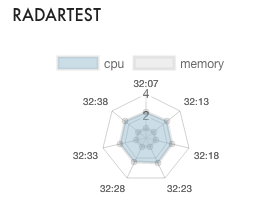
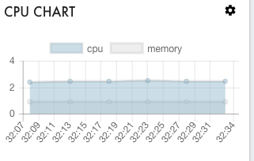
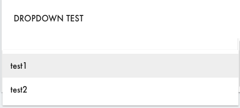

# MatrixOS Config Widget examples

# Layout

```
screens:
  - - cpu
    - memory
```

# Displays

## Value

```
cpu:
  type: monitor
  key: cpu
  display: digit
  format: round
  label: cpu
```

## Bar Chart

```
barChart:
  type: monitor
  keys: cpu, memory
  display: bar
  label: Bar Chart
```

## Radar Chart

```
radarTest:
  type: monitor
  keys: cpu,memory
  display: radar
  label: radarTest
```

## Line Chart

```
cpuChart:
  type: monitor
  keys: cpu,memory
  display: line
  label: CPU Chart
```

## Lists

```
info:
  type: device
  display: list-group
  label: Secret Information
```

# Interactive

## Buttons

### Single

```
buttonTest:
  label: Hacking Buttons
  control: button
  trigger: buttonInfo
  value: Get Secret Information
```
###### Handling Code
```
matrix.on('buttonInfo', function(){
  // ...
})
```
`trigger` in the config file, is the event name (`buttonInfo`) handled.


### Multiple

```
buttonsTest:
  label: Matrix Activation Buttons
  control: button
  map:
    'amps+': buttonUp
    'amps-': buttonDown
    begin : buttonStart
    end : buttonStop
    capture : buttonSample
    'refresh+' : buttonSlow
    'refresh-' : buttonFast
```
###### Handling Code
```
 matrix.on('buttonStop', function(){
   //...
})

 matrix.on('buttonStart', function(){
   //...
 })

 matrix.on('buttonSample', function () {
   //...
 })
```
## Drop Downs

```
dropDown:
  control: dropdown
  map:
    test1: doTest1
    test2: doTest2
  label: dropdown test
```
###### Handling Code
```
matrix.on('doTest1', function(){
 //...
})


matrix.on('doTest2', function(){
 //...
})
```
# Responsive Data Flow
```
matrix.on('buttonInfo', function(){
  matrix.type('device').send({
    'os_hostname': os.hostname(),
    'os_type': os.type(),
    'os_platform': os.platform(),
    'os_arch': os.arch()
  });
})
```
When `buttonInfo` is triggered, respond with information with a type `device`.

The list looks for
```
list:
  type: device
```
which tells it to display information with type `device`.
